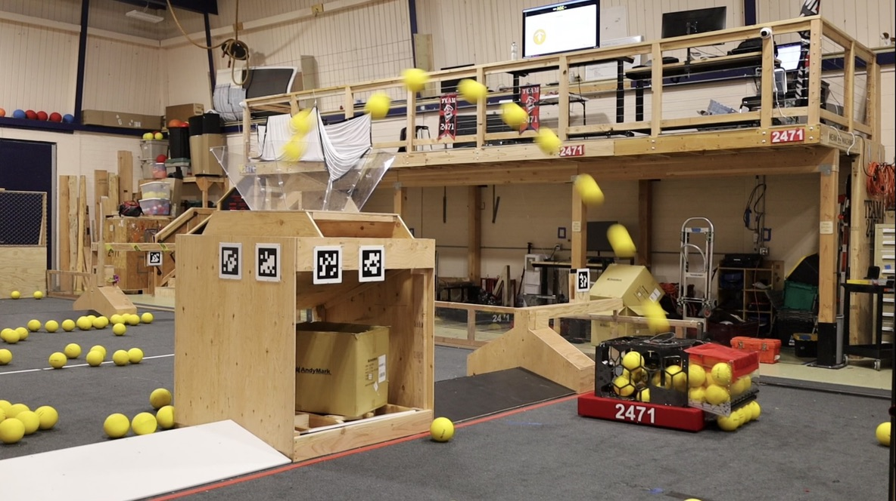

# Team Mean Machine 2471 Code 2026

Code for Team Mean Machine's 2026 robot Sisyphus.

## Notable Features

- Field-centric controlled Turret using onboard Pigeon 2 (RemotePigeon2Yaw), with wrap limits.
- Custom physics sim to generate shooter speed/angle curves
- Shoot on the move
- Offboard [Particle Filter](https://github.com/TeamMeanMachine/ParticleFilter) program ran on DS to calculate robot position.
- Custom utility library [Meanlib](https://github.com/TeamMeanMachine/meanlib)
- Photonvision
- Choreo
- CTRE Swerve API
- Kotlin

Tech Binder, Reveal Video, TBA: https://team2471.org/past-robots/

